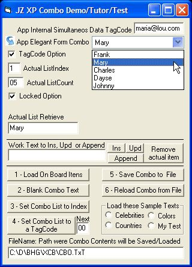



## JZ XP Combo Box v1\.2 revised

### Description

Easy and functional free as XP Combo Box - all normal one and plus TagCodes, Load/Save from txt file, on-line updating, etc. See http://www.planet-source-code.com/vb/scripts/ShowCode.asp?txtCodeId=60511&amp;lngWId=1

now in same version.
 
### More Info
 

             |
---                |---
**Submitted On**   |2005-05-16 19:32:20
**By**             |[JOZE Walter Moura](https://github.com/Planet-Source-Code/PSCIndex/blob/master/ByAuthor/joze-walter-moura.md)
**Level**          |Intermediate
**User Rating**    |5.0 (30 globes from 6 users)
**Compatibility**  |VB 6\.0
**Category**       |[Custom Controls/ Forms/  Menus](https://github.com/Planet-Source-Code/PSCIndex/blob/master/ByCategory/custom-controls-forms-menus__1-4.md)
**World**          |[Visual Basic](https://github.com/Planet-Source-Code/PSCIndex/blob/master/ByWorld/visual-basic.md)
**Archive File**   |[JZ\_XP\_Comb1888855162005\.ZIP](https://github.com/Planet-Source-Code/joze-walter-moura-jz-xp-combo-box-v1-2-revised__1-60555/archive/master.zip)

